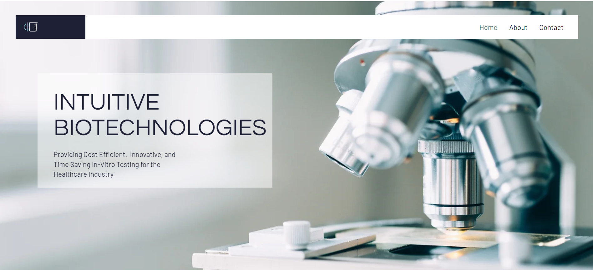

# IBT Case Study
A comprehensive case study and revamp of Intuitive BioTechnologies' website, focusing on improved user experience, modern design, and enhanced functionality.

## Website Comparison: Old vs New

### Overview
This project represents a complete redesign of the Intuitive BioTechnologies website, transforming it from a static, outdated design to a modern, responsive, and user-friendly interface.

### Design & Visual Improvements

#### **Old Website**
- Static layout with limited visual hierarchy
- Outdated color scheme and typography
- Dense text blocks with poor readability
- Basic styling with minimal visual appeal
- No responsive design considerations

#### **New Website**
- Modern, clean design with improved visual hierarchy
- Professional color palette featuring gold accent and green highlights
- Elegant typography using DM Sans font family
- Responsive layout that adapts to different screen sizes
- Strategic use of whitespace for better content organization

### User Experience Enhancements

#### **Navigation**
- **Old**: Basic navigation with limited structure
- **New**: 
  - Sticky navigation header for consistent access
  - Smooth scrolling to page sections
  - Clear visual indicators and hover effects
  - Logo animation on page load

#### **Content Organization**
- **Old**: Information presented in a single column with poor structure
- **New**: 
  - Well-organized sections (About Us, Services, Contact)
  - Card-based layout for services with clear categorization
  - Improved content hierarchy with proper headings and subheadings

#### **Interactive Elements**
- **Old**: Minimal interactivity
- **New**:
  - Scroll-triggered animations for engaging user experience
  - Interactive contact form with proper field validation
  - Hover effects on navigation and interactive elements
  - Smooth transitions and animations throughout